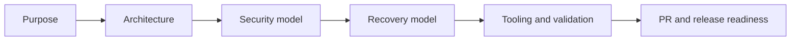

# LockerIt Documentation

This folder contains long-form product and engineering documentation for LockerIt.

The root [README.md](../README.md) is the public entry point. These documents go deeper into architecture decisions, security boundaries, recovery flows, and developer tooling.

## Map

| Document | Purpose |
| --- | --- |
| [product-purpose.md](product-purpose.md) | Defines the LockerIt purpose, user promise, design personality, and non-negotiables. |
| [architecture.md](architecture.md) | Explains the app/core/storage boundaries and how the desktop shell talks to the vault engine. |
| [security-model.md](security-model.md) | Documents encryption, DPAPI usage, threat boundaries, and known limitations. |
| [recovery.md](recovery.md) | Describes Recovery Kit export, import, local keyring refresh, and cross-device behavior. |
| [tooling.md](tooling.md) | Lists developer commands, GitHub CLI metadata commands, package controls, and validation steps. |

Repository-level process files live outside this folder:

- [CONTRIBUTING.md](../CONTRIBUTING.md)
- [LICENSE](../LICENSE)
- [.github/workflows/build.yml](../.github/workflows/build.yml)

## Documentation Principles

- Keep user-facing language clear enough for a non-security specialist.
- Keep engineering details precise enough to review implementation risk.
- Avoid documenting future work as if it already exists.
- When a feature is planned, label it as planned.
- Treat recovery and key management as first-class product flows.

## High-Level Flow

## Source of Truth

The source code remains the implementation source of truth. The docs describe the expected behavior of the current implementation and should be updated in the same pull request whenever behavior changes.
