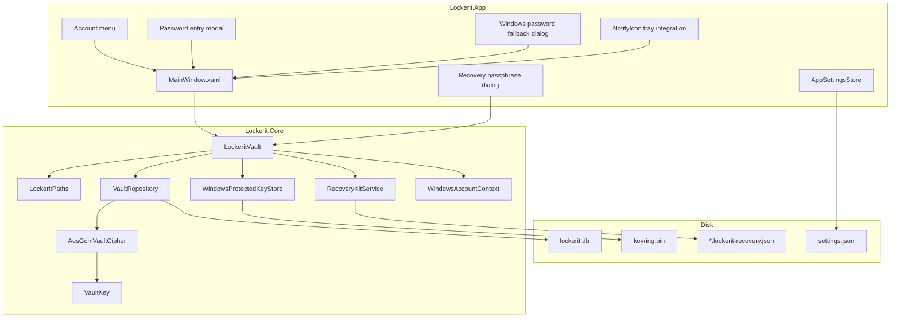
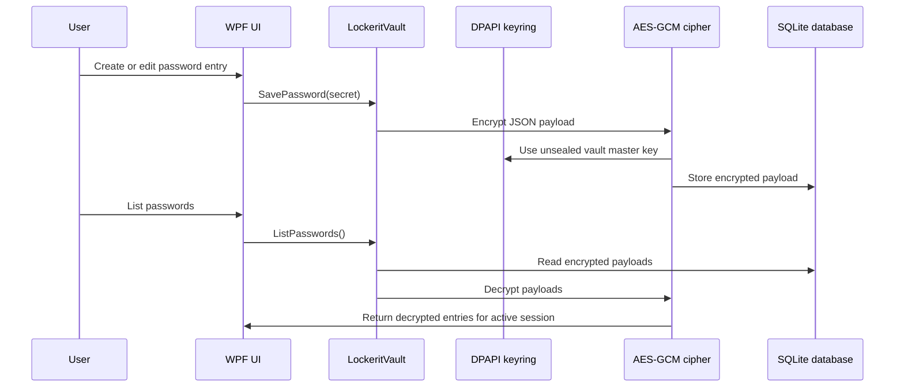

# Architecture

LockerIt is split into a WPF desktop shell and a small core library. The WPF app owns interaction. The core library owns vault behavior. This keeps UI iteration separate from security and storage code.

## Goals

- Run as a standalone Windows desktop app.
- Keep all secret data local.
- Encrypt payloads before storage.
- Keep the local Windows account as the daily unlock boundary.
- Make cross-device recovery explicit and auditable.
- Avoid unnecessary dependencies.

## Component Diagram



## Boundaries

| Boundary | Owner | Responsibilities |
| --- | --- | --- |
| `Lockerit.App` | UI shell | Windows, input, dialogs, tray icon, settings screen, status messages. |
| `Lockerit.Core` | Vault engine | Key handling, encryption, SQLite repository, recovery import/export. |
| SQLite database | Local storage | Durable encrypted item payloads and item metadata. |
| DPAPI keyring | Windows user profile | Day-to-day protection of the vault master key for the current Windows account. |
| Recovery Kit | User-managed portable file | Cross-device encrypted copy of the vault master key. |

## Data Flow



## Storage Model

SQLite stores a typed encrypted item table:

```text
VaultItems
|-- Id TEXT PRIMARY KEY
|-- Kind TEXT
`-- Payload TEXT
```

The payload is opaque to SQLite. It is a base64-packed AES-GCM envelope generated by the core cipher. This allows new item kinds later, such as encrypted files, without changing the basic storage boundary.

## UI Model

The current app uses:

- focused unlock screen with no sidebar;
- dark workspace shell;
- sidebar navigation for Passwords and Settings;
- account menu with log out;
- password table with row actions;
- modal editor for create/edit;
- Settings recovery actions;
- tray icon for hide/show/lock behavior.

## Extension Points

| Future area | Expected extension point |
| --- | --- |
| Secure file storage | Add a new item kind and file payload envelope in `Lockerit.Core`. |
| Stronger KDF | Add a new Recovery Kit version and keep v1 import compatibility. |
| Hardware-backed keys | Add a key provider beside DPAPI without changing encrypted payload shape. |
| Import/export bundles | Add a bundle format that carries database plus Recovery Kit metadata without plaintext secrets. |
