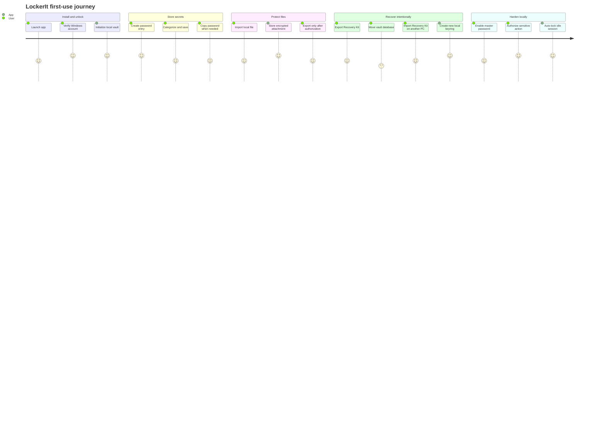

# Product Purpose

LockerIt is a local vault for people who want serious protection without surrendering their secrets to a web service. It starts with passwords and encrypted file attachments because credentials, documents, recovery codes, keys, exports, and identity files often live in the same risky local folders.

## Product Promise

LockerIt should make a user feel three things:

1. My secrets are local.
2. My secrets are encrypted before storage.
3. I can recover intentionally, but nobody gets cross-device access accidentally.

## Target User

The first target user is a technical Windows user who stores sensitive material locally and distrusts casual cloud sync for everything. This user values control, visual polish, speed, and clear security boundaries.

The second target user is the future non-technical user who wants a calm desktop vault that does not require understanding DPAPI, AES-GCM, SQLite, or KDFs.

## Personality

LockerIt should feel:

- dark, modern, and quiet;
- serious without feeling corporate;
- compact but not cramped;
- security-focused without alarmist copy;
- local-first and intentional;
- closer to a modern AI tool workspace than a legacy WinForms utility.

## Non-Negotiables

| Principle | Meaning |
| --- | --- |
| No WebAPI | The app must not require a remote API to store or unlock local secrets. |
| No plaintext storage | Secret payloads must be encrypted before SQLite writes. |
| Windows account boundary | Daily unlock belongs to the current Windows account. |
| Explicit recovery | Cross-device unlock requires a Recovery Kit and passphrase. |
| No accidental key reset | Existing encrypted databases must not silently receive a new random key. |
| Dark UI | The product is dark-first and should not ship a white default surface. |
| Small supply chain | Dependencies must stay intentional and explainable. |

## Current Product Shape

## What LockerIt Is Not

- It is not a cloud password manager.
- It is not a browser extension.
- It is not a team secret-sharing service.
- It is not a remote identity platform.
- It is not a generic file sync tool.

Those capabilities may be adjacent to the problem space, but they would weaken the first product promise if added too early.
