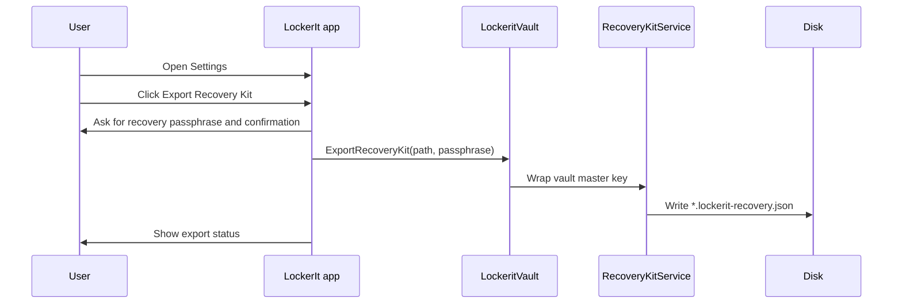
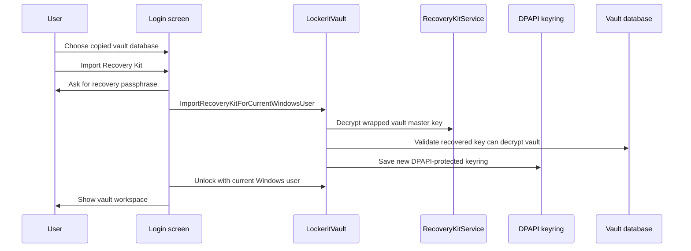
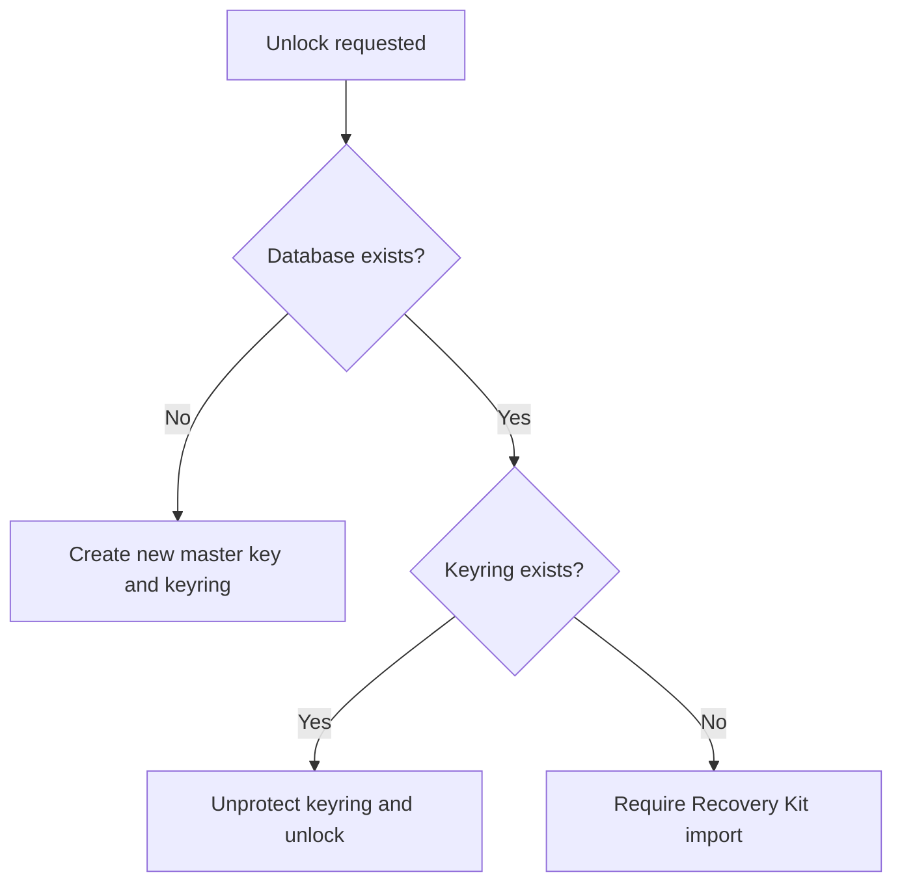

# Recovery

LockerIt recovery is designed for cross-device use without copying the Windows DPAPI keyring. The vault database can be copied. The Recovery Kit can be copied. The passphrase should be kept separately.

## Recovery Artifacts

| Artifact | Portable | Contains plaintext passwords | Purpose |
| --- | --- | --- | --- |
| Vault database | Yes | No | Stores encrypted vault item payloads. |
| DPAPI keyring | No | No | Protects the vault master key for one Windows account. |
| Recovery Kit | Yes | No | Stores an encrypted copy of the vault master key. |
| Recovery passphrase | User memory or separate secret store | N/A | Unlocks the Recovery Kit. |

## Export Flow

Export does not change the vault database. It creates a small JSON document containing versioned KDF parameters, AES-GCM fields, and a key fingerprint. It does not contain plaintext passwords.

## Import Flow

Import validates that the recovered key can open the selected vault before writing the local keyring. If validation fails, the local keyring is not updated.

## Local Keyring Refresh

Settings includes a refresh action that re-saves the current unlocked vault master key into the current Windows account's DPAPI keyring. This is useful after Windows profile repair, keyring migration, or recovery import.

## Missing-Keyring Guard

If a database exists but no local keyring exists, LockerIt refuses to call `OpenOrCreate` as if the vault were new. This prevents accidental key replacement.

## Recommended User Procedure

1. Export a Recovery Kit after creating the first important vault entries.
2. Store the Recovery Kit away from the vault database.
3. Store the recovery passphrase separately from both files.
4. Test import on a non-production copy before relying on it.
5. Refresh the Recovery Kit after major vault/key policy changes.

## Failure Cases

| Failure | Expected behavior |
| --- | --- |
| Wrong recovery passphrase | Import fails and does not overwrite the local keyring. |
| Wrong vault database | Recovered key validation fails before keyring update. |
| Missing vault database | UI asks the user to choose or copy the vault database first. |
| Existing local keyring | UI asks for confirmation before replacing it. |
| Forgotten recovery passphrase | LockerIt cannot recover it. |
