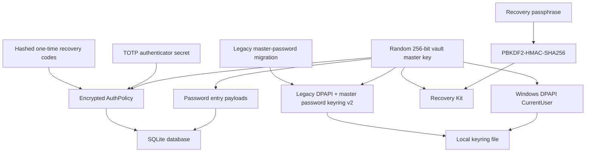
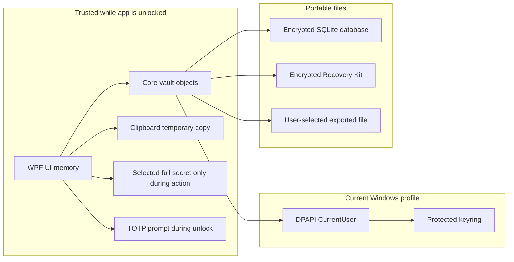

# Security Model

LockerIt protects local vault data by separating three secrets:

1. The vault database, which stores encrypted payloads.
2. The vault master key, which decrypts those payloads.
3. The recovery passphrase, which can unwrap a portable copy of the master key.
4. The optional AuthPolicy authenticator secret and recovery codes, which gate the unlocked app session.
5. Legacy master-password keyrings, which can be opened for migration but are no longer exposed as a desktop setting.

The database can move. The local DPAPI keyring should not move. The Recovery Kit can move, but it is useless without the recovery passphrase.

## Security Goals

- Never write plaintext password entries to SQLite.
- Bind daily unlock to the current Windows account.
- Require explicit user action for cross-device recovery.
- Avoid generating a new master key over an existing encrypted database.
- Keep implementation dependencies small and auditable.

## Key Hierarchy



## Cryptography

| Purpose | Mechanism |
| --- | --- |
| Vault master key | 256-bit random key generated with `RandomNumberGenerator`. |
| Vault item encryption | AES-256-GCM with authenticated additional data per purpose. |
| Local keyring protection | Windows DPAPI with `DataProtectionScope.CurrentUser`. |
| Legacy master-password keyring | DPAPI-protected v2 keyring whose inner vault key is wrapped with PBKDF2-HMAC-SHA256 plus AES-256-GCM. Supported for unlock/migration, not exposed as a new desktop setting. |
| AuthPolicy TOTP | RFC 6238-style 6-digit TOTP using a 160-bit random Base32 secret and HMAC-SHA1. |
| AuthPolicy setup QR | Local QR matrix generation for the `otpauth://` setup URI; no network service or QR package is required. |
| AuthPolicy recovery codes | Random one-time codes stored only as salted SHA-256 hashes inside the encrypted AuthPolicy payload. |
| Recovery wrapping key | PBKDF2-HMAC-SHA256, 256-bit random salt, 600,000 iterations. |
| Recovery Kit encryption | AES-256-GCM over the vault master key. |
| Recovery Kit fingerprint | HMAC-SHA256 over a fixed purpose string using the recovered vault key. |

## Trust Boundaries



While unlocked, the app necessarily holds decrypted values in memory to display, copy, edit, or export them. LockerIt reduces exposure by using password and file summaries in list views, loading full secrets only for selected actions, clearing modal fields on close/lock, auto-clearing clipboard values, requiring Windows authorization for sensitive actions, optionally requiring TOTP before showing the workspace, and auto-locking after 15 minutes of inactivity. These are exposure reductions, not a hard boundary against malware running as the same Windows user.

## Threat Model

| Threat | Current posture |
| --- | --- |
| Stolen `.db` file | Password payloads remain encrypted without the vault master key. |
| Stolen DPAPI keyring from another Windows account | Not directly useful because DPAPI CurrentUser binds unprotect to the original profile. |
| Stolen Recovery Kit without passphrase | Not directly useful because the master key is wrapped by passphrase-derived AES-GCM. |
| Stolen Recovery Kit with forgotten passphrase | A non-secret hint can help the user remember, but LockerIt cannot recover the passphrase without an unlocked source device. |
| Missing keyring next to existing database | LockerIt refuses to create a new key and requires Recovery Kit import. |
| Malware running as same unlocked user | Mitigated with Windows authorization at unlock, auto-lock, optional TOTP AuthPolicy gate, and reduced decrypted list memory; still outside the hard boundary. Routine copy/download actions are intentionally frictionless after unlock. |
| Forgotten legacy master password | Recovery Kit import or an already-unlocked source device is required. New desktop setup uses AuthPolicy instead. |
| Lost authenticator app | One-time AuthPolicy recovery codes can satisfy the TOTP gate, then the user can regenerate or replace TOTP from Settings. |
| Supply-chain package compromise | Mitigated by small dependency set, lock files, and explicit NuGet source mapping. |

## Non-Goals For Current Phase

- Cloud sync.
- Remote identity provider.
- Network-backed MFA service.
- Multi-user vault sharing.
- Enterprise key escrow.
- Direct TPM-held vault key storage.
- Full memory hardening against local malware.

## Limitation Corrections And Residual Risk

| Previous limitation | Correction or mitigation | Residual risk |
| --- | --- | --- |
| Malware in the same unlocked user session | Windows authorization is required before unlock, sessions auto-lock after 15 minutes, and AuthPolicy can require TOTP before the workspace opens. | Same-user malware can still interact with process memory and user-scoped APIs. |
| Forgotten recovery passphrase | Recovery Kit can carry a non-secret hint, and an unlocked source device can export a new kit. | No escrow exists by design. |
| No separate master password | AuthPolicy TOTP is the supported second factor; legacy master-password keyrings remain unlockable for migration. | Losing the Recovery Kit/passphrase or all valid AuthPolicy recovery paths can block recovery. |
| No hardware-backed key option | Windows Hello/PIN/biometric user presence is used when available. | The vault master key is not directly stored as a TPM-held key. |
| No encrypted file attachments | Implemented typed encrypted file attachment payloads. | Large-file streaming is not implemented. |
| Decrypted strings in UI memory | Lists store summaries without password, notes, or file bytes; full payloads are loaded only by ID for action. | Active edit/copy/export still requires plaintext in process memory briefly. |

## Sensitive Files

The repository ignores local runtime secrets:

```text
*.db
*.db-shm
*.db-wal
*.sqlite
*.keyring.bin
*.lockerit-recovery.json
settings.json
.env
*.pem
*.pfx
*.key
```

These files should never be committed.
