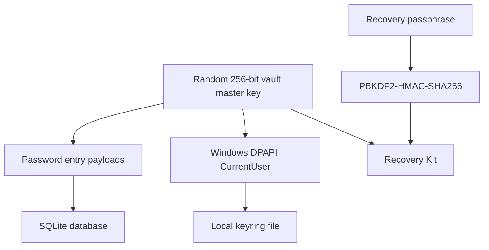
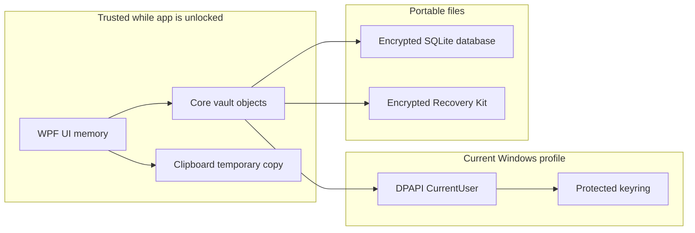

# Security Model

LockerIt protects local vault data by separating three secrets:

1. The vault database, which stores encrypted payloads.
2. The vault master key, which decrypts those payloads.
3. The recovery passphrase, which can unwrap a portable copy of the master key.

The database can move. The local DPAPI keyring should not move. The Recovery Kit can move, but it is useless without the recovery passphrase.

## Security Goals

- Never write plaintext password entries to SQLite.
- Bind daily unlock to the current Windows account.
- Require explicit user action for cross-device recovery.
- Avoid generating a new master key over an existing encrypted database.
- Keep implementation dependencies small and auditable.

## Key Hierarchy



## Cryptography

| Purpose | Mechanism |
| --- | --- |
| Vault master key | 256-bit random key generated with `RandomNumberGenerator`. |
| Vault item encryption | AES-256-GCM with authenticated additional data per purpose. |
| Local keyring protection | Windows DPAPI with `DataProtectionScope.CurrentUser`. |
| Recovery wrapping key | PBKDF2-HMAC-SHA256, 256-bit random salt, 600,000 iterations. |
| Recovery Kit encryption | AES-256-GCM over the vault master key. |
| Recovery Kit fingerprint | HMAC-SHA256 over a fixed purpose string using the recovered vault key. |

## Trust Boundaries



While unlocked, the app necessarily holds decrypted values in memory to display and copy them. The clipboard auto-clear reduces exposure after copy, but it is not a hard security boundary because other processes can observe the clipboard.

## Threat Model

| Threat | Current posture |
| --- | --- |
| Stolen `.db` file | Password payloads remain encrypted without the vault master key. |
| Stolen DPAPI keyring from another Windows account | Not directly useful because DPAPI CurrentUser binds unprotect to the original profile. |
| Stolen Recovery Kit without passphrase | Not directly useful because the master key is wrapped by passphrase-derived AES-GCM. |
| Missing keyring next to existing database | LockerIt refuses to create a new key and requires Recovery Kit import. |
| Malware running as same unlocked user | Out of current hard boundary; malware can interact with user-scoped APIs and process memory. |
| Forgotten recovery passphrase | Not recoverable by design. |
| Supply-chain package compromise | Mitigated by small dependency set, lock files, and explicit NuGet source mapping. |

## Non-Goals For Current Phase

- Cloud sync.
- Remote identity provider.
- Multi-user vault sharing.
- Enterprise key escrow.
- Hardware-backed key storage.
- Full memory hardening against local malware.

## Sensitive Files

The repository ignores local runtime secrets:

```text
*.db
*.db-shm
*.db-wal
*.sqlite
*.keyring.bin
*.lockerit-recovery.json
settings.json
.env
*.pem
*.pfx
*.key
```

These files should never be committed.
