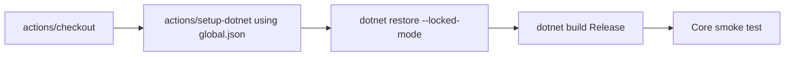

# Tooling

This document lists the project tools, command-line workflows, metadata commands, and validation expectations.

## Product Tools

```mermaid
flowchart TB
    LockerIt["LockerIt"]
    Passwords["Password vault"]
    Recovery["Recovery tools"]
    AuthPolicy["AuthPolicy tools"]
    Desktop["Desktop shell"]
    Security["Security tools"]
    Developer["Developer tools"]

    LockerIt --> Passwords
    LockerIt --> Recovery
    LockerIt --> AuthPolicy
    LockerIt --> Desktop
    LockerIt --> Security
    LockerIt --> Developer

    Passwords --> Create["Create/edit/delete entries"]
    Passwords --> Search["Search and category filter"]
    Passwords --> Copy["Copy username/password"]
    Passwords --> Generate["Generate password"]
    Passwords --> Files["Encrypted file attachments"]

    Recovery --> Export["Export Recovery Kit"]
    Recovery --> Import["Import Recovery Kit"]
    Recovery --> Refresh["Refresh local keyring"]
    Recovery --> Hint["Recovery hint metadata"]

    AuthPolicy --> Totp["Enable/replace TOTP"]
    AuthPolicy --> Codes["Regenerate recovery codes"]
    AuthPolicy --> Gate["Unlock session gate"]

    Desktop --> Tray["Tray icon"]
    Desktop --> Settings["Settings workspace"]
    Desktop --> Account["Account log out menu"]

    Security --> Hello["Windows Hello/PIN/biometric"]
    Security --> Dpapi["DPAPI keyring"]
    Security --> Master["Optional master password"]
    Security --> Policy["Encrypted AuthPolicy"]
    Security --> Aes["AES-GCM payload encryption"]
    Security --> AutoLock["Auto-lock"]

    Developer --> Build["dotnet build"]
    Developer --> Actions["GitHub Actions build"]
    Developer --> Smoke["Core smoke test"]
    Developer --> Gh["GitHub CLI"]
```



## Required Local Tools

| Tool | Purpose |
| --- | --- |
| .NET 10 SDK | Build, run, and test. |
| Git | Source control. |
| GitHub CLI | Repository metadata, branch publishing, and pull requests. |
| Windows 11 | Primary runtime target for Windows Hello/PIN/biometric integration. |

## GitHub Actions

The CI workflow lives at `.github/workflows/build.yml`.

It runs on `windows-latest` for pushes to `main`, pushes to `codex/**`, and pull requests targeting `main`.



## Build Commands

```powershell
dotnet restore Lockerit.slnx
dotnet build Lockerit.slnx
```

## Run Command

```powershell
dotnet run --project src/Lockerit.App/Lockerit.App.csproj
```

## Test Command

```powershell
dotnet run --project tests/Lockerit.Core.SmokeTests/Lockerit.Core.SmokeTests.csproj
```

## GitHub Metadata Command

The repository description and topics can be updated with:

```powershell
gh repo edit viamus/locker-it `
  --description "LockerIt is a Windows-first standalone encrypted vault for passwords, Recovery Kits, and future secure files." `
  --add-topic dotnet `
  --add-topic wpf `
  --add-topic windows `
  --add-topic password-manager `
  --add-topic local-first `
  --add-topic sqlite `
  --add-topic dpapi `
  --add-topic aes-gcm `
  --add-topic recovery-kit `
  --add-topic security
```

## Pull Request Workflow

```powershell
git switch -c codex/<short-topic>
dotnet build Lockerit.slnx
dotnet run --project tests/Lockerit.Core.SmokeTests/Lockerit.Core.SmokeTests.csproj
git add .
git commit -m "<message>"
git push -u origin codex/<short-topic>
gh pr create --base main --head codex/<short-topic> --title "<title>" --body "<body>"
```

## Supply-Chain Controls

| Control | File |
| --- | --- |
| Package lock files | `Directory.Build.props` |
| Explicit package source mapping | `NuGet.Config` |
| Small dependency surface | `src/Lockerit.Core/Lockerit.Core.csproj` |
| Runtime secret ignore rules | `.gitignore` |
| CI workflow | `.github/workflows/build.yml` |
| Project license | `LICENSE` |
| Contribution guide | `CONTRIBUTING.md` |

## Before Opening A PR

Run:

```powershell
git status --short --branch
git diff --check
dotnet build Lockerit.slnx
dotnet run --project tests/Lockerit.Core.SmokeTests/Lockerit.Core.SmokeTests.csproj
```

Check that no runtime vault data is staged:

```powershell
git diff --cached --name-only
```

Do not stage:

- `.db`, `.sqlite`, `*-wal`, `*-shm`;
- `keyring.bin` or `*.keyring.bin`;
- `*.lockerit-recovery.json`;
- `settings.json`;
- `.env`;
- certificates or private keys.
