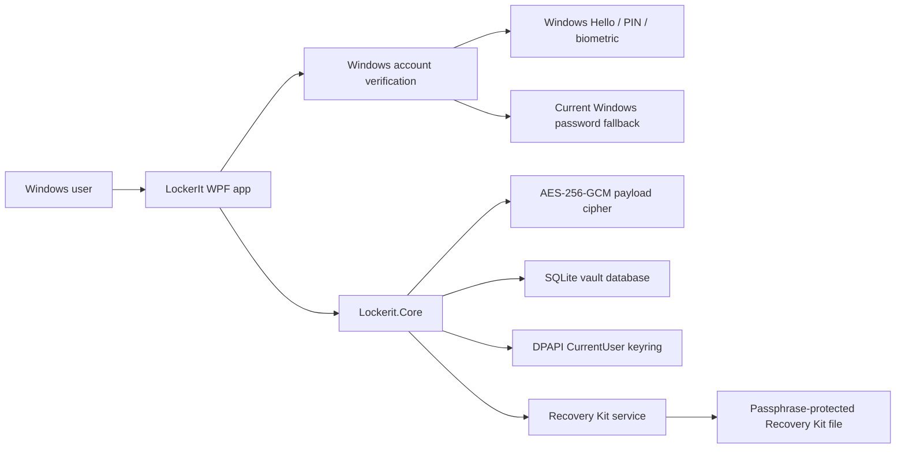
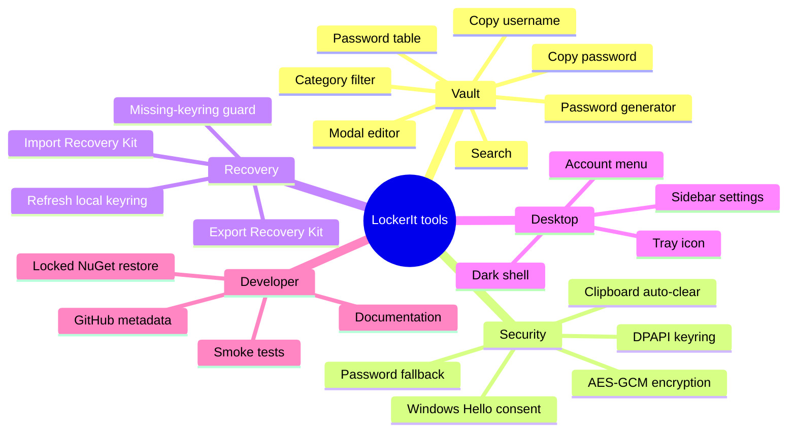
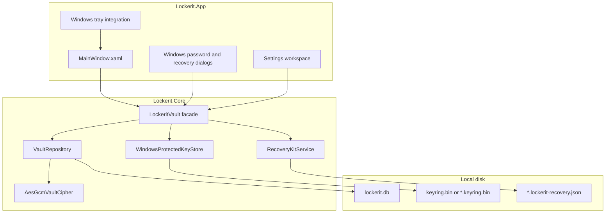
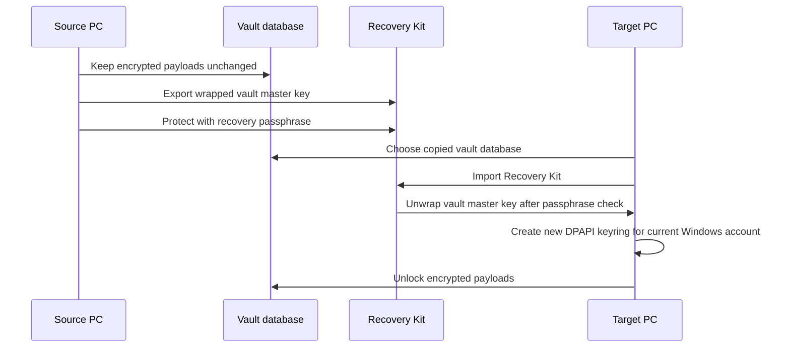

# LockerIt

LockerIt is a Windows-first, standalone encrypted vault for passwords today and secure files tomorrow. It is intentionally local-first: no WebAPI, no cloud dependency, no background sync service, and no remote account model. The vault belongs to the Windows account that unlocks it.

The project is built with .NET 10, WPF, SQLite, Windows DPAPI, Windows Hello/PIN/biometric consent, and AES-256-GCM encrypted payloads.

## Why LockerIt Exists

Important credentials and private documents often live as plain files, browser exports, notes, screenshots, or spreadsheets on a local disk. LockerIt exists to put a hardened local boundary around that material without forcing the user into a cloud password manager or a network service.

The first product target is a beautiful dark desktop vault that feels modern, direct, and calm. The first security target is more important: local secrets should be encrypted before they reach storage, tied to the current Windows account for daily unlock, and recoverable across devices only through an explicit Recovery Kit.

## Product Principles

- Standalone desktop application.
- Dark-only interface.
- No runtime network dependency.
- No WebAPI.
- No plaintext secrets in SQLite.
- Windows account boundary for daily unlock.
- Explicit cross-device recovery through a passphrase-protected Recovery Kit.
- Small dependency footprint and locked package restore.
- UI that feels like a real product, not an admin sample app.

## Current Capabilities

| Area | Capability | Status |
| --- | --- | --- |
| Desktop shell | Dark WPF app with sidebar navigation, account menu, tray icon and modal editor | Implemented |
| Authentication | Windows Hello/PIN/biometric prompt with current Windows password fallback | Implemented |
| Password vault | Create, read, update, delete, search and categorize password entries | Implemented |
| Encryption | AES-256-GCM encrypted JSON payloads before SQLite persistence | Implemented |
| Local keyring | 256-bit vault master key protected with Windows DPAPI CurrentUser | Implemented |
| Recovery | Export/import Recovery Kit and re-protect local keyring | Implemented |
| Storage settings | Configurable vault database path | Implemented |
| Smoke tests | End-to-end core test for CRUD, encryption, recovery and keyring loss | Implemented |
| Secure files | Encrypted file payloads | Planned |

## System Overview



LockerIt separates daily unlock from cross-device recovery. Daily unlock uses the current Windows account to unseal a local keyring. Cross-device recovery uses a Recovery Kit that wraps the same vault master key with a user-provided recovery passphrase.

## Tool Map

The word "tool" in this repository means a concrete capability that helps the user manage or protect vault data.



## Runtime Architecture



The WPF app owns interaction and state. The core library owns encryption, storage, recovery, and Windows account key handling. SQLite is treated as a durable encrypted payload store, not as the security boundary.

## Security Model

On first unlock, LockerIt creates a random 256-bit vault master key. That key encrypts all vault items. Daily unlock stores the master key in a Windows DPAPI-protected local keyring:

```text
%APPDATA%\Lockerit\keyring.bin
```

The default SQLite database is:

```text
%APPDATA%\Lockerit\lockerit.db
```

For custom database paths, the keyring is stored beside the selected database using:

```text
<database-name>.keyring.bin
```

Password entries are serialized as JSON, encrypted with AES-256-GCM, and only then written to SQLite. The database stores item ID, item kind, and encrypted payload. The keyring is protected with `DataProtectionScope.CurrentUser`, so another Windows profile cannot unprotect it directly.

## Recovery Model

The DPAPI keyring is intentionally not portable. A copied keyring from one Windows account should not unlock the vault on another account. Cross-device recovery uses a separate Recovery Kit:



The Recovery Kit uses PBKDF2-HMAC-SHA256 with a 256-bit random salt, 600,000 iterations, and AES-256-GCM authenticated encryption. If a vault database already exists but the local keyring is missing, LockerIt refuses to generate a new random key and asks the user to import a Recovery Kit instead.

## Repository Layout

```text
.
|-- .docs/
|   |-- README.md
|   |-- architecture.md
|   |-- product-purpose.md
|   |-- recovery.md
|   |-- security-model.md
|   `-- tooling.md
|-- src/
|   |-- Lockerit.App/
|   `-- Lockerit.Core/
|-- tests/
|   `-- Lockerit.Core.SmokeTests/
|-- Lockerit.slnx
|-- Directory.Build.props
|-- NuGet.Config
|-- global.json
`-- README.md
```

## Documentation

- [.docs/README.md](.docs/README.md) explains the documentation map.
- [.docs/product-purpose.md](.docs/product-purpose.md) defines the product purpose, user promise, and non-negotiables.
- [.docs/architecture.md](.docs/architecture.md) describes the app, core, storage, and UI boundaries.
- [.docs/security-model.md](.docs/security-model.md) documents encryption, DPAPI, threat boundaries, and limitations.
- [.docs/recovery.md](.docs/recovery.md) explains export, import, and keyring refresh flows.
- [.docs/tooling.md](.docs/tooling.md) lists local developer commands, GitHub CLI metadata commands, and supply-chain controls.

## Build

```powershell
dotnet restore Lockerit.slnx
dotnet build Lockerit.slnx
```

## Run

```powershell
dotnet run --project src/Lockerit.App/Lockerit.App.csproj
```

## Test

```powershell
dotnet run --project tests/Lockerit.Core.SmokeTests/Lockerit.Core.SmokeTests.csproj
```

The smoke test validates:

- password CRUD;
- no plaintext password bytes in SQLite database or WAL;
- Recovery Kit export;
- no plaintext password bytes in the Recovery Kit;
- failed import with a wrong passphrase;
- successful import after deleting the local keyring;
- recovered vault unlock.

## Supply-Chain Posture

The dependency set is intentionally small:

- `Microsoft.Data.Sqlite`
- `System.Security.Cryptography.ProtectedData`

`NuGet.Config` maps package restore to `nuget.org`, and `Directory.Build.props` enables package lock files. The repository ignores local databases, keyrings, Recovery Kits, settings, environment files, certificates, private keys, and build artifacts.

## Current Limitations

- Malware already running as the same unlocked Windows user can still interact with the app or ask Windows to decrypt user-scoped secrets.
- The recovery passphrase cannot be recovered by LockerIt if forgotten.
- There is no separate master password option yet.
- There is no hardware-backed key option yet.
- Encrypted file attachments are not implemented yet.
- Decrypted strings can exist in UI memory while the app is open.
