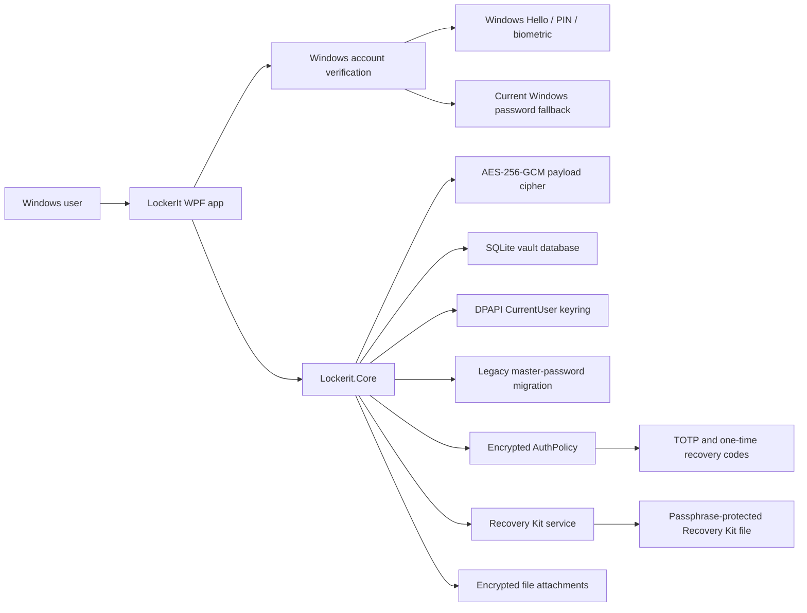
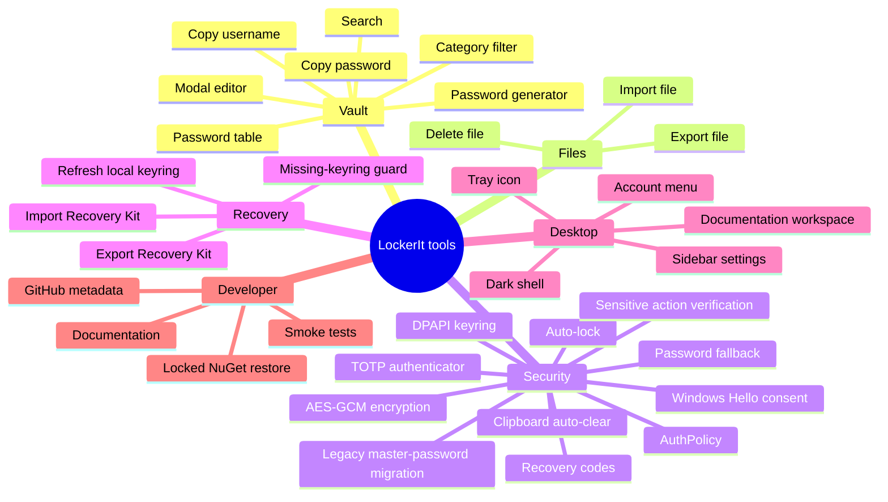
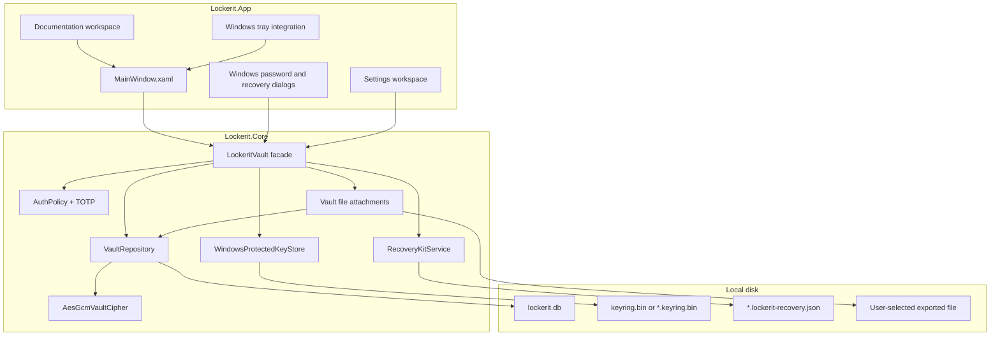
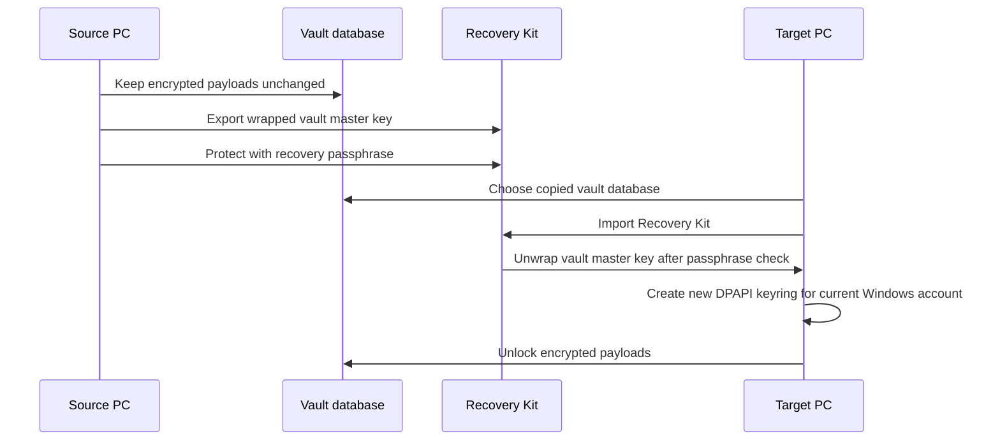

# LockerIt

[](https://github.com/viamus/locker-it/actions/workflows/build.yml)


<p align="center">
  
</p>

LockerIt is a Windows-first, standalone encrypted vault for passwords and secure file attachments. It is intentionally local-first: no WebAPI, no cloud dependency, no background sync service, and no remote account model. The vault belongs to the Windows account that unlocks it.

The project targets Windows 11+ and is built with .NET 10, WPF, SQLite, Windows DPAPI, Windows Hello/PIN/biometric consent, TOTP AuthPolicy gates, and AES-256-GCM encrypted payloads.

## Why LockerIt Exists

Important credentials and private documents often live as plain files, browser exports, notes, screenshots, or spreadsheets on a local disk. LockerIt exists to put a hardened local boundary around that material without forcing the user into a cloud password manager or a network service.

The first product target is a beautiful dark desktop vault that feels modern, direct, and calm. The first security target is more important: local secrets should be encrypted before they reach storage, tied to the current Windows account for daily unlock, and recoverable across devices only through an explicit Recovery Kit.

## Product Principles

- Standalone desktop application.
- Dark-only interface.
- No runtime network dependency.
- No WebAPI.
- No plaintext secrets in SQLite.
- Windows account boundary for daily unlock.
- Explicit cross-device recovery through a passphrase-protected Recovery Kit.
- Local AuthPolicy for optional authenticator app verification.
- Small dependency footprint and locked package restore.
- UI that feels like a real product, not an admin sample app.

## Current Capabilities

| Area | Capability | Status |
| --- | --- | --- |
| Desktop shell | Dark WPF app that opens maximized with sidebar navigation, account menu, tray icon and modal editor | Implemented |
| Authentication | Windows Hello/PIN/biometric prompt with current Windows password fallback | Implemented |
| Password vault | Create, read, update, delete, search and categorize password entries | Implemented |
| Encryption | AES-256-GCM encrypted JSON payloads before SQLite persistence | Implemented |
| Local keyring | 256-bit vault master key protected with Windows DPAPI CurrentUser | Implemented |
| Recovery | Export/import Recovery Kit, optional passphrase hint and re-protect local keyring | Implemented |
| Legacy master password | Existing master-password keyrings can still unlock and are migrated back to Windows + AuthPolicy protection | Compatibility |
| AuthPolicy 2FA | Encrypted vault policy with TOTP QR setup, inline six-digit login check and one-time recovery codes | Implemented |
| Secure files | Encrypted file attachments with import/export/delete, search and category filter | Implemented |
| Documentation | Repository README, `.docs/`, contribution guide and license | Implemented |
| Session hardening | 15-minute inactivity auto-lock and Windows verification for sensitive actions | Implemented |
| Storage settings | Configurable vault database path | Implemented |
| Smoke tests | End-to-end core test for CRUD, encryption, recovery and keyring loss | Implemented |
| CI | GitHub Actions build and smoke test workflow | Implemented |

## System Overview



LockerIt separates daily unlock from cross-device recovery. Daily unlock uses the current Windows account to unseal a local keyring. Cross-device recovery uses a Recovery Kit that wraps the same vault master key with a user-provided recovery passphrase.

## Tool Map

The word "tool" in this repository means a concrete capability that helps the user manage or protect vault data.



## Runtime Architecture



The WPF app owns interaction and state. The core library owns encryption, storage, recovery, and Windows account key handling. SQLite is treated as a durable encrypted payload store, not as the security boundary.

## Security Model

On first unlock, LockerIt creates a random 256-bit vault master key. That key encrypts all vault items. Daily unlock stores the master key in a Windows DPAPI-protected local keyring:

```text
%APPDATA%\Lockerit\keyring.bin
```

The default SQLite database is:

```text
%APPDATA%\Lockerit\lockerit.db
```

For custom database paths, the keyring is stored beside the selected database using:

```text
<database-name>.keyring.bin
```

Password entries and file attachment payloads are serialized as JSON, encrypted with AES-256-GCM, and only then written to SQLite. The database stores item ID, item kind, and encrypted payload. The keyring is protected with `DataProtectionScope.CurrentUser`, so another Windows profile cannot unprotect it directly.

Older LockerIt builds could add a master password to the local keyring. The desktop UI no longer exposes that option because AuthPolicy 2FA is the supported second factor. Existing master-password keyrings can still be opened for compatibility and are re-saved into the Windows + AuthPolicy model after unlock.

LockerIt AuthPolicy adds another local gate after the vault key is opened: an encrypted policy item inside the vault can require a TOTP authenticator code before the workspace is shown. The setup dialog renders a local QR code and also provides the manual setup key/URI as fallback. The same policy stores hashed one-time recovery codes. Because AuthPolicy lives in the encrypted database, it moves with the vault across devices and remains protected by the vault master key.

## Recovery Model

The DPAPI keyring is intentionally not portable. A copied keyring from one Windows account should not unlock the vault on another account. Cross-device recovery uses a separate Recovery Kit:



The Recovery Kit uses PBKDF2-HMAC-SHA256 with a 256-bit random salt, 600,000 iterations, and AES-256-GCM authenticated encryption. It can store a non-secret passphrase hint to help the user remember the recovery passphrase. If a vault database already exists but the local keyring is missing, LockerIt refuses to generate a new random key and asks the user to import a Recovery Kit instead.

## Repository Layout

```text
.
|-- .github/
|   `-- workflows/
|       `-- build.yml
|-- .docs/
|   |-- README.md
|   |-- architecture.md
|   |-- product-purpose.md
|   |-- recovery.md
|   |-- security-model.md
|   `-- tooling.md
|-- src/
|   |-- Lockerit.App/
|   `-- Lockerit.Core/
|-- tests/
|   `-- Lockerit.Core.SmokeTests/
|-- Lockerit.slnx
|-- Directory.Build.props
|-- CONTRIBUTING.md
|-- LICENSE
|-- NuGet.Config
|-- global.json
`-- README.md
```

## Documentation

- [.docs/README.md](.docs/README.md) explains the documentation map.
- [.docs/product-purpose.md](.docs/product-purpose.md) defines the product purpose, user promise, and non-negotiables.
- [.docs/architecture.md](.docs/architecture.md) describes the app, core, storage, and UI boundaries.
- [.docs/security-model.md](.docs/security-model.md) documents encryption, DPAPI, threat boundaries, and limitations.
- [.docs/recovery.md](.docs/recovery.md) explains export, import, and keyring refresh flows.
- [.docs/tooling.md](.docs/tooling.md) lists local developer commands, GitHub CLI metadata commands, and supply-chain controls.

## Platform

LockerIt is a Windows 11+ desktop application. The app targets `net10.0-windows10.0.22000.0` so Windows 11 APIs such as Windows Hello/PIN/biometric consent and DPAPI CurrentUser behavior are treated as first-class runtime assumptions.

## Build

Use this as the canonical local build method:

```powershell
dotnet restore Lockerit.slnx --locked-mode
dotnet build Lockerit.slnx --configuration Release --no-restore -p:ContinuousIntegrationBuild=true
```

That matches the GitHub Actions build job before the core smoke test runs.

## Run

```powershell
dotnet run --project src/Lockerit.App/Lockerit.App.csproj
```

## Test

```powershell
dotnet run --project tests/Lockerit.Core.SmokeTests/Lockerit.Core.SmokeTests.csproj
```

The smoke test validates:

- password CRUD;
- password list summaries without decrypted password or notes;
- encrypted file attachment import/export core behavior;
- no plaintext password bytes in SQLite database or WAL;
- no plaintext file bytes in SQLite database or WAL;
- Recovery Kit export;
- no plaintext password bytes in the Recovery Kit;
- Recovery Kit passphrase hint metadata;
- failed import with a wrong passphrase;
- successful import after deleting the local keyring;
- AuthPolicy TOTP enable, verify, recovery-code consume and persistence;
- legacy master-password keyring unlock/migration behavior;
- recovered vault unlock.

## Supply-Chain Posture

The dependency set is intentionally small:

- `Microsoft.Data.Sqlite`
- `System.Security.Cryptography.ProtectedData`

`NuGet.Config` maps package restore to `nuget.org`, and `Directory.Build.props` enables package lock files. The repository ignores local databases, keyrings, Recovery Kits, settings, environment files, certificates, private keys, and build artifacts.

## Risk Posture

| Previous limitation | Current correction or mitigation | Residual risk |
| --- | --- | --- |
| Malware already running as the same unlocked Windows user can interact with the app or user-scoped APIs. | Unlock requires Windows authorization, the app auto-locks after 15 minutes of inactivity, and AuthPolicy can require TOTP before the workspace opens. Routine copy/download actions stay frictionless after unlock. | Malware with the same user context is still outside the hard boundary of a local desktop app. |
| Recovery passphrase cannot be recovered if forgotten. | Recovery Kits can include a non-secret hint, and an already-unlocked source device can export a new kit. | LockerIt still cannot recover a forgotten passphrase without an unlocked source or another valid Recovery Kit. That is intentional to avoid escrow. |
| No separate master password option. | Replaced by AuthPolicy TOTP as the supported second factor. Legacy master-password keyrings remain unlockable for migration. | Losing the Recovery Kit/passphrase or all valid AuthPolicy recovery paths can still block cross-device recovery. |
| No hardware-backed key option. | Windows Hello/PIN/biometric user presence is used for unlock and sensitive actions when available. | Direct TPM-held vault key storage is not implemented yet. |
| Encrypted file attachments are not implemented. | Implemented encrypted file attachment import/export/delete using the same AES-GCM vault payload model. | Large-file streaming and attachment previews are not implemented yet. |
| Decrypted strings can exist in UI memory while the app is open. | Password and file lists use summaries without decrypted passwords, notes, or file bytes; full secrets are loaded only for specific actions; modal fields are cleared on close/lock. | WPF strings and password fields can still exist in process memory during active use. |

## License

LockerIt is licensed under the [MIT License](LICENSE).
